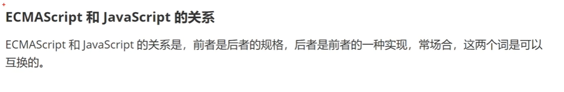
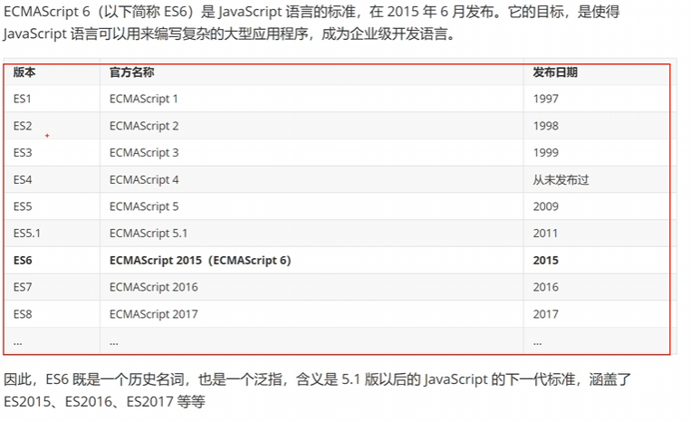

# JS6 简介

## 什么是 ECMAScript 6？

ECMAScript 6和JavaScript的关系:

- ECMAScript 6是JavaScript的下一代标准，它是JavaScript的最新版本。
- ECMAScript 6是JavaScript的语法的最新版本，它包含了许多新特性，如箭头函数、类、模板字符串、解构赋值、Promise、模块化、迭代器、生成器、Proxy、Reflect等。
- ECMAScript 6是JavaScript的未来版本，它将会成为JavaScript的主流版本。

> font>

## 名词解释

>自从2015年后的js6,今后的js都可被称为es6.

## 特性

- 箭头函数
- 类
- 模板字符串
- 解构赋值
- Promise
- 模块化
- 迭代器
- 生成器
- Proxy
- Reflect
- 尾调用优化
- 其他新特性
- 其他

## 参考资料

1. [ECMAScript 6 入门](http://es6.ruanyifeng.com/)
2. [阮一峰-ECMAScript 6入门](http://es6.ruanyifeng.com/)
3. [阮一峰-ECMAScript 6 标准入门](http://es6.ruanyifeng.com/)   