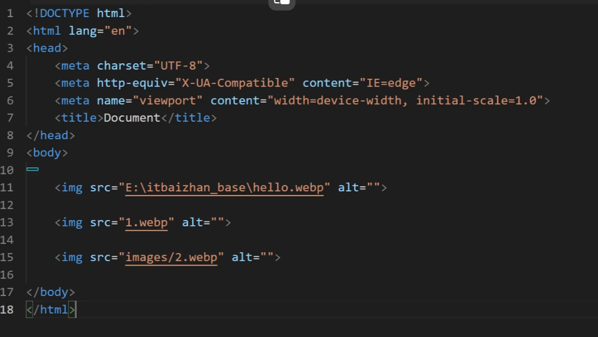

# markdown用法
### 有序列表：
1. 第一项
2. 第二项
3. 第三项

### 无序列表：
- 第一项
- 第二项
- 第三项

### 选择列表：
- [x] 已完成
- [ ] 未完成
  
### 代码块：
```python
print("Hello, world!")
```

```c
 #include <stdio.h>
 int main() {
   printf("Hello, world!");
   return 0;
 }
```
### 数学公式：
$$E=mc^2$$


### 脚注：
这是脚注1[^1]


[^1]: 脚注内容,会自动生成横线


### 表格：
|  表头1  |  表头2  |  表头3  |
| :-----: | :----: | :-----: |
|  单元格  |  单元格  |  单元格  |
|  单元格  |  单元格  |  单元格  |

### 横线:

---


### 链接：
[百度](https://www.baidu.com)
[百度][id_1]
[id_1]不能与[百度][id_1]所在的代码块有接触

[id_1]: https://www.baidu.com

### 文字加粗、斜体、下划线：

**加粗**
*斜体*
_下划线_

### 字体颜色：
<font color="red">红色</font>

### 引用：
> 这是一个引用

### 参考：

请参考[参考文献1][id_1]
请参考[参考文献2](#脚注)

### 图片：

也可以使用HTML标签：


### URL:
https://www.markdown.com.cn/

### 表情包:
:smile: :laughing: :blush: :smiley: :relaxed: :smirk: :heart_eyes: :kissing_heart: :kissing_closed_eyes: :flushed: :relieved: :satisfied: :grin: :wink: :stuck_out_tongue_winking_eye: :stuck_out_tongue_closed_eyes: :grinning: :kissing_smiling_eyes: :stuck_out_tongue: :sleeping: :worried: :frowning: :anguished: :open_mouth: :grimacing: :confused: :hushed: :expressionless: :unamused: :sweat_smile: :sweat: :disappointed_relieved: :weary: :pensive: :disappointed: :confounded: :fearful: :cold_sweat: :persevere: :cry: :sob: :joy: :astonished: :scream: :tired_face: :angry: :rage: :triumph: :sleepy: :yum: :mask: :sunglasses: :dizzy_face: :imp: :smiling_imp: :neutral_face: :no_mouth: :innocent: :alien: :yellow_heart: :blue_heart: :purple_heart: :heart: :green_heart: :broken_heart: :heartbeat: :heartpulse: :two_hearts: :revolving_hearts: :cupid: :sparkling_heart: :sparkles: :star: :star2: :dizzy: :boom: :collision: :anger: :exclamation: :question: :grey_exclamation: :grey_question: :zzz: :dash: :sweat_drops: :notes: :musical_note: :fire: :hankey: :poop: :shit: :+1: :thumbsup: :-1: :thumbsdown: :ok_hand: :punch: :facepunch: :fist: :v: :wave: :hand: :raised_hand: :open_hands: :point_up: :point_down: :point_left: :point_right: :raised_hands: :pray: :point_up_2: :clap: :muscle: :metal: :fu: :runner: :running: :couple: :family: :two_men_holding_hands: :two_women_holding_hands: :dancer:


### 公式：
$$H_2O + O_2 \rightarrow H_2O$$

$$\begin{bmatrix} a & b \\ c & d \end{bmatrix}$$


### 高亮：


==1123==(默认高亮为橙色)

==1123==


### 嵌入视频：

<iframe src="//player.bilibili.com/player.html?isOutside=true&aid=327623069&bvid=BV1JA411h7Gw&cid=171385214&p=1" scrolling="no" border="0" frameborder="no" framespacing="0" allowfullscreen="true"></iframe>


Markdown 语法参考 : https://www.runoob.com/markdown/md-tutorial.html
表情全部名称：https://unicode.org/emoji/charts/full-emoji-list.html