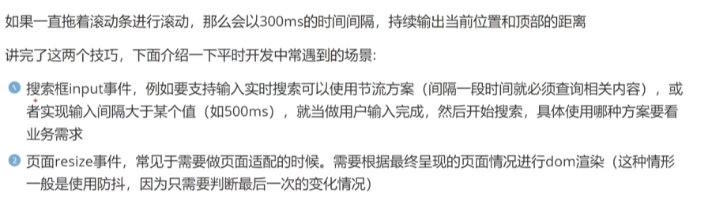

# 节流
>当按这浏览器的滚动条时,使用防抖不会输出和执行函数,因此引入节流.
## 介绍

节流（throttle）是一种常用的函数式编程技术，它通过限制函数的执行频率来优化代码的运行效率。

## 原理
节流（Throttling）:
节流技术则确保函数以固定的频率执行。这意味着无论事件触发多少次，函数都会按照设定的时间间隔执行一次。
节流的典型应用场景是，当用户在执行某个操作时，你希望以一定的频率执行某个操作。例如，浏览器窗口大小调整时，你可能希望每隔一段时间（比如100毫秒）才检查一次窗口大小。

## 与防抖的区别

 ==两者的区别==:

==1.触发时机==：防抖是在事件最后一次触发后等待一定的延迟时间才执行，如果在这个延迟时间内又被触发，则重新计算延迟时间；节流则是无论事件触发多少次，都会按照设定的时间间隔执行一次。
==2.适用场景==：防抖适用于用户完成操作后才执行的场景，如搜索框输入；节流适用于用户在操作过程中需要控制执行频率的场景，如滚动事件。
==3.函数执行次数==:防抖可能导致函数在触发事件后延迟执行，如果事件频繁触发，则函数可能根本不执行；节流则保证函数一定会执行，只是执行的频率被限制。

节流与防抖的区别在于，节流的执行频率是固定的，而防抖的执行频率是可变的。

## 节流实现

节流的实现方式有两种：

1. 定时器实现：通过定时器来控制函数的执行频率。
2. 时间戳实现：通过记录上一次函数执行的时间戳来控制函数的执行频率。
   

### 定时器实现

1. 定义一个函数，并传入需要节流的函数和执行间隔时间（毫秒）。
2. 在函数执行前，通过 setTimeout 设置一个定时器，在定时器结束后再执行函数。
3. 最后返回一个新的函数，该函数会在每次调用时，都会重新设置一个定时器。
4. 这样，在函数执行前，会先设置一个定时器，在定时器结束后才执行函数。

