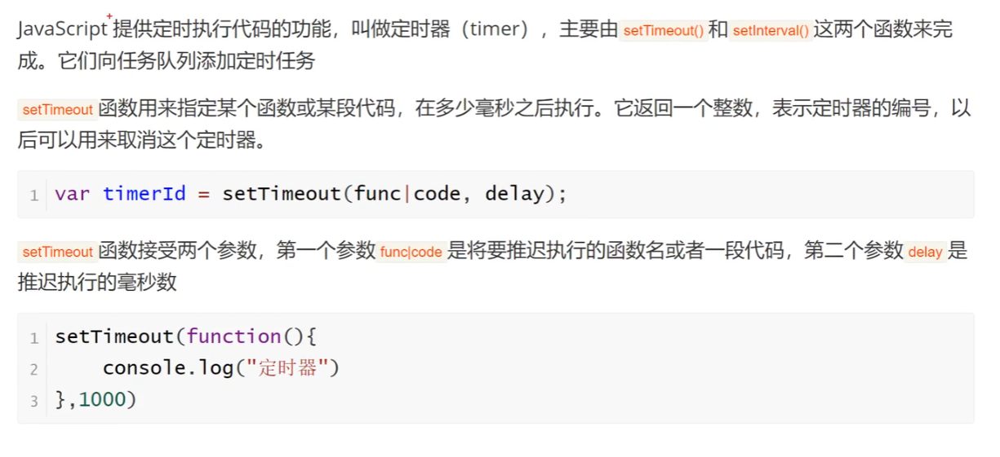
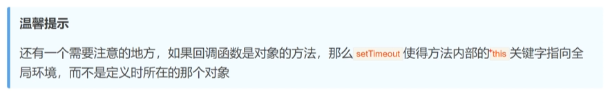

# 计时器(JavaScript)

## 大概

- 计时器功能，可以设置计时时间，并显示剩余时间。
- 计时器可以暂停、继续、重置。
- 计时器可以设置是否循环。

## 实现(主要讲JavaScript的实现)

### 1.setTimeout()函数

- setTimeout()函数可以设置一个定时器，在指定的时间后执行一个函数。
- 语法：setTimeout(function, time);
- function：要执行的函数。==(也可以是一段代码，用括号包起来)==
- time：定时器的执行时间，_单位为毫秒_。

注意事项:

### 2.clearTimeout()函数

- clearTimeout()函数可以取消setTimeout()函数设置的定时器。
- 语法：clearTimeout(timer);
- timer：setTimeout()函数返回的定时器ID。

### 3.setInterval()函数

- setInterval()函数可以设置一个定时器，每隔指定的时间就执行一次函数。
- 语法：setInterval(function, time);
- function：要执行的函数。==(也可以是一段代码，用括号包起来)==
- time：定时器的执行间隔时间，_单位为毫秒_。

### 4.clearInterval()函数

- clearInterval()函数可以取消setInterval()函数设置的定时器。
- 语法：clearInterval(timer);
- timer：setInterval()函数返回的定时器ID。

