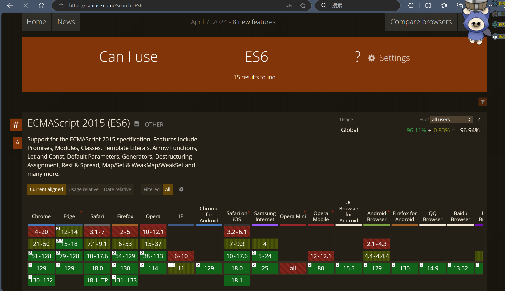

# Babel

Babel是一个JavaScript编译器，它可以将ES6代码转换为ES5代码，使得现代浏览器可以运行。

Babel的安装和使用方法请参考[Babel官网](https://babeljs.io/)。

>资料:
>浏览器支持性查看: https://caniuse.com/
>

要直接使用 npm 下载 Babel，你可以按照以下步骤操作：

打开终端或命令提示符：

在你的计算机上打开命令行界面。
确保 npm 可用：

运行以下命令来检查 npm 是否已安装和可用：
bash
npm -v
如果 npm 未安装，你需要先安装 Node.js，它通常会附带 npm。
创建一个新的项目（可选）：

如果你想要在一个新的项目中使用 Babel，可以初始化一个新的 npm 项目：
bash
mkdir my-babel-project
cd my-babel-project
npm init -y
这将创建一个新的 package.json 文件。
安装 Babel：

使用以下命令安装 Babel 核心包和必要的预设：
bash
npm install --save-dev @babel/core @babel/cli @babel/preset-env
这些命令会安装 Babel 核心库、Babel CLI 工具和 @babel/preset-env 预设，后者用于将 ES6+ 代码转换为向后兼容的 JavaScript 代码。
配置 Babel：

在项目根目录下创建一个名为 .babelrc 的配置文件（或者使用 babel.config.json）：
json
{
  "presets": ["@babel/preset-env"]
}
这个配置文件告诉 Babel 使用 @babel/preset-env 预设来转换代码。
使用 Babel 编译代码：

你现在可以使用 Babel CLI 来编译代码。例如，要编译 src 目录中的所有 JavaScript 文件并将它们输出到 lib 目录，可以使用以下命令：
bash
npx babel src --out-dir lib
npx 是 npm 5.2.0 及更高版本附带的一个包运行工具，它允许你运行项目中的本地 npm 包而不需要全局安装它们。
验证安装：

安装完成后，你可以在项目中使用 Babel 来转换 JavaScript 代码。
如果你在中国地区，为了加速下载，你可以设置 npm 使用国内镜像：

bash
npm config set registry https://registry.npm.taobao.org
这将确保在安装 Babel 时，npm 会从淘宝的 npm 镜像下载，速度通常会更快。

npm init命令是在哪里进行的

npm init 命令是在命令行界面（CLI）中执行的，它用于初始化一个新的 Node.js 项目并创建一个新的 package.json 文件。以下是详细步骤：

打开命令行界面：

在 Windows 上，你可以使用“命令提示符”（CMD）或“PowerShell”。
在 macOS 或 Linux 上，你可以使用“终端”（Terminal）。
导航到项目目录：

使用 cd 命令切换到你想要创建新项目的目录。例如，如果你的项目位于 Documents 文件夹中，你可以这样做：
bash
cd ~/Documents
创建项目目录（可选）：

如果你还没有项目目录，你可以使用 mkdir 命令创建一个：
bash
mkdir my-new-project
cd my-new-project
这将创建一个名为 my-new-project 的新目录，并切换到该目录。
执行 npm init 命令：

在项目目录中，运行以下命令：
bash
npm init
这将启动一个交互式命令行会话，它会询问你一些关于你的项目的问题，例如项目名称、版本、描述、作者等。
填写信息：

你可以按照提示依次输入信息。如果你只是想要快速生成一个 package.json 文件，可以一直按回车键接受默认值。
完成初始化：

回答完所有问题后，npm 会在你的项目目录中创建一个 package.json 文件。
检查 package.json 文件：

你可以使用文本编辑器打开 package.json 文件，查看并编辑项目的配置信息。
如果你想要非交互式地生成 package.json 文件，可以使用 -y 标志，这样会自动接受所有默认值：

bash
npm init -y
这将创建一个包含默认值的 package.json 文件，而不会询问任何问题。

npm init 是开始新 Node.js 项目的常用第一步，它为项目定义了基础结构和元数据。

那么有没有用cnpm的方法安装

要使用 cnpm 安装 Babel，你可以按照以下步骤操作：

安装 cnpm：
如果你还没有安装 cnpm，可以通过 npm 来安装它：

bash
npm install -g cnpm --registry=https://registry.npmmirror.com
这将安装 cnpm 并设置淘宝的 npm 镜像为默认源 
。

使用 cnpm 安装 Babel：
安装 Babel 核心包和必要的预设：

bash
cnpm install --save-dev @babel/core @babel/cli @babel/preset-env
这些命令会安装 Babel 核心库、Babel CLI 工具和 @babel/preset-env 预设，后者用于将 ES6+ 代码转换为向后兼容的 JavaScript 代码 
。

验证安装：
安装完成后，你可以在项目中使用 Babel 来转换 JavaScript 代码。

如果你想要非交互式地生成 package.json 文件，可以使用 -y 标志，这样会自动接受所有默认值：

bash
npm init -y
这将创建一个包含默认值的 package.json 文件，而不会询问任何问题。

cnpm 是淘宝 NPM 镜像的客户端，它可以作为 npm 的替代品，提高在国内使用 npm 时的下载速度 
。

我希望用阿里的镜像,这些不同的镜像之间有没有什么区别

使用阿里的 npm 镜像可以通过以下两种主要方式：

使用 cnpm 命令行工具：
cnpm 是淘宝 NPM 镜像的一个定制版本，它可以作为 npm 的替代品。它背后的服务器位于中国，因此对于国内用户来说，使用 cnpm 可以显著提高包的下载速度。要安装 cnpm，你可以运行以下命令：

bash
npm install -g cnpm --registry=https://registry.npmmirror.com
安装完成后，你可以通过将所有 npm 命令替换为 cnpm 来使用它。例如，安装一个包时使用：

bash
cnpm install [package_name]
更多信息可以参考 
。

配置 npm 使用阿里的镜像：
如果你不想安装 cnpm，你可以直接配置 npm 使用阿里的 npm 镜像。运行以下命令来设置阿里的 npm 镜像为默认源：

bash
npm config set registry https://registry.npmmirror.com
这样，你可以直接使用 npm 命令，而下载将从国内的镜像源进行，从而提高下载速度。要验证是否配置成功，可以使用：

bash
npm config get registry
如果输出的是阿里的镜像地址，则表示配置成功。更多信息可以参考 
。

两种方法都可以提高在中国大陆地区使用 npm 时的下载速度。选择哪一种取决于你的个人偏好。如果你希望全局使用阿里的镜像而不是每次使用时都指定，建议使用方法 2。如果你在公司或团队中，可能需要确保所有开发者都使用相同的方法来避免潜在的包版本不一致问题。